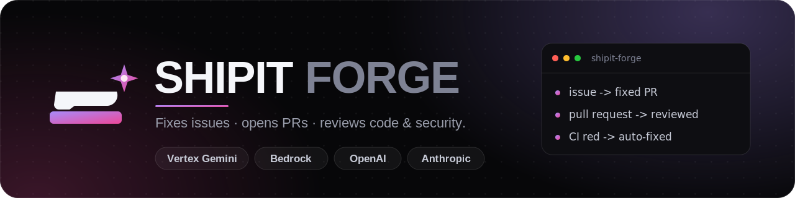

<div align="center">



<br/>

**An autonomous GitHub coding agent — like a teammate that fixes issues, opens PRs, and reviews pull requests (with a GitHub Advanced Security–style security pass).**

Multi-provider · Vision-aware · Self-hosted · Original open-source code.

<br/>

[](https://github.com/shipiit/forge/actions/workflows/ci.yml)
[](./LICENSE)
[](https://nodejs.org)
[](https://www.typescriptlang.org)
[](#testing)
[](#contributing)

<br/>

**Providers:**
&nbsp;`Vertex AI Gemini`&nbsp;·&nbsp;`AWS Bedrock`&nbsp;·&nbsp;`OpenAI`&nbsp;·&nbsp;`Anthropic`

[Quick start](#-quick-start-no-credentials) · [Deploy](#-deploy-as-a-github-app) · [How it works](#-how-it-works) · [Config](#-configuration) · [Roadmap](#-roadmap)

</div>

---

## ✨ What it does

| | Capability | How you trigger it |
|---|---|---|
| 🛠️ | **Fix an issue → open a PR** — investigates the repo, writes the fix on a branch, runs the tests, opens a PR that closes the issue | Label `agent-fix`, or comment `/fix` |
| 🔍 | **Review a PR** — inline comments + summary verdict, quality **and** security lenses | Open a PR, or comment `/review` |
| 🛡️ | **Security review** — flags SSRF, injection, secrets, authz… with **severity** + a **suggested-fix** block | Auto on PRs, or comment `/security` |
| 👋 | **Invite as a reviewer** — request `@shipit-forge` on any PR and it reviews on demand | Add it as a PR reviewer |
| 💬 | **Answer @mentions** — explains code on issues; on a PR it can **push a follow-up commit** to the branch | Comment `@shipit-forge <ask>` |
| 🖼️ | **Reads screenshots** — pulls images out of issue/PR bodies and feeds them to vision models | Automatic |

---

## 📦 Installation

**Prerequisites:** [Node.js](https://nodejs.org) **≥ 20** (22 recommended), `git`, and (optional but
faster search) [`ripgrep`](https://github.com/BurntSushi/ripgrep).

```bash
# 1. Clone
git clone https://github.com/shipiit/forge.git
cd forge

# 2. Install dependencies
npm install

# 3. Build (compiles TypeScript → dist/)
npm run build

# 4. Verify everything works (88 unit + integration tests)
npm test
```

That's it — you now have the `forge` CLI at `node dist/cli.js`. (Optionally `npm link` to get a
global `forge` command.)

## 🚀 Quick start (no credentials)

The agent engine runs locally with a built-in **fake provider** — no API keys needed, great for a
first look:

```bash
node dist/cli.js fix --repo /path/to/any/repo --task "fix the failing login test" --provider fake
```

It clones nothing (works on the path you give), runs the tool loop, and prints what changed.

### Configure a provider securely — `forge setup`

The easiest, safest way to add your credentials. It writes a **gitignored `.env` with `chmod 600`**
so secrets never get committed:

```bash
node dist/cli.js setup
```

```
🔧 ShipIT Forge — provider setup

Which provider?
  1) Vertex AI Gemini
  2) Anthropic
  3) OpenAI
  4) AWS Bedrock
> 1
GCP project id: <your-gcp-project-id>
Location [us-central1]:
Model [gemini-2.5-pro]:
Provide the service-account key. Either:
  • a path to the JSON file, or
  • paste the JSON, then a line with just END
path or paste> <paste your service-account JSON, or a file path>
✅ Wrote .env (chmod 600) and updated .gitignore. Your secrets are gitignored.
```

**Setting up Vertex AI credentials (step by step):**

1. In Google Cloud Console → **IAM & Admin → Service Accounts**, create a service account (or reuse one).
2. Give it the **Vertex AI User** role (`roles/aiplatform.user`).
3. **Keys → Add key → JSON** to download the key file. Keep it private — never commit it.
4. Run `forge setup`, choose **Vertex AI Gemini**, enter your project id, and either **paste the JSON**
   or give the **path** to the downloaded file.

When you paste, the JSON is validated and saved to `.forge/vertex-sa.json` (`chmod 600`, gitignored);
when you give a path, it's referenced in place. Either way nothing secret is ever committed.

### Or set env vars manually

```bash
export LLM_PROVIDER=vertex
export VERTEX_PROJECT=my-gcp-project
export VERTEX_LOCATION=us-central1
export GOOGLE_APPLICATION_CREDENTIALS=/path/to/service-account.json
node dist/cli.js fix --repo /path/to/repo --task "…" --provider vertex
```

See [`.env.example`](./.env.example) for every provider's variables.

### Test it end-to-end with a real model (2 minutes)

Make a tiny buggy repo and let Forge fix it:

```bash
# 1. A throwaway repo with a deliberate bug + a test
mkdir /tmp/forge-try && cd /tmp/forge-try && git init -q
printf 'export const add = (a, b) => a - b; // bug\n' > sum.js
printf "import test from 'node:test'; import assert from 'node:assert'; import {add} from './sum.js';\ntest('adds', () => assert.strictEqual(add(2,3), 5));\n" > sum.test.js
printf '{"type":"module","scripts":{"test":"node --test"}}\n' > package.json
git add -A && git commit -qm init

# 2. Point Forge at it with your provider (Vertex shown)
cd -                                   # back to the forge repo
export GOOGLE_APPLICATION_CREDENTIALS=/path/to/service-account.json
node dist/cli.js fix --repo /tmp/forge-try \
  --task "add() subtracts instead of adding; fix it so the tests pass" \
  --provider vertex --model gemini-2.5-pro
```

Forge will read `sum.js`, change `a - b` → `a + b`, run `node --test`, confirm it passes, and print
the diff. *(This exact flow is verified working against Vertex AI Gemini 2.5 Pro.)* ✅

---

## 🤖 Deploy as a GitHub App

> **Publishing the code ≠ running the agent.** GitHub stores your repo and the App *registration*,
> but the agent runs on **your** server. GitHub sends webhooks → your server clones the repo, calls
> the model, and opens the PR/review. Docker is just a portable way to run that server anywhere.

**1. Deploy the webhook server**

```bash
docker build -t shipit-forge .
docker run -p 3000:3000 --env-file .env shipit-forge
# any host works: Cloud Run, Fly.io, Render, Railway, a VM — it just needs a public HTTPS URL.
```

**2. Register the GitHub App (one click)**

With the server running, open its URL (e.g. `http://localhost:3000` in dev, or your public URL).
Probot serves a **registration page** driven by [`app.yml`](./app.yml):

1. Click **Register a GitHub App** → it redirects you to GitHub with the name, permissions, and
   events pre-filled from `app.yml`.
2. Pick the **owner** — choose your **organization** (e.g. `shipiit`) so the App belongs to the org.
3. Confirm. GitHub creates the App and redirects back; Probot **automatically writes** `APP_ID`,
   `PRIVATE_KEY`, and `WEBHOOK_SECRET` into your `.env`. Add your provider vars and restart.

Prefer manual? GitHub → **Settings → Developer settings → GitHub Apps → New GitHub App**, then copy
the permissions/events from [`app.yml`](./app.yml).

> **Keep it private while testing.** `app.yml` has `public: false`, so only orgs **you administer**
> can install it — perfect for trying it inside your own org first. Flip to `public: true` later to
> allow any org and to list it on the Marketplace.

**Set the App icon** — in the App's **Settings → Display information → Logo**, upload
[`assets/logo.png`](./assets/logo.png) (the anvil-and-spark mark). A 512×512 and a 1024×1024
([`logo-1024.png`](./assets/logo-1024.png)) export are included.

**3. Install on your org (test it)** — App page → **Install App** → your org → pick **one test repo**
(or All repositories). Then open an issue with the `agent-fix` label, or request `@shipit-forge` on a
PR, and watch it work. Once it behaves, widen to all repos and/or make it public.

**4. Invite & test it** — in any repo of that org:
- open an issue and add the label **`agent-fix`** (or comment **`/fix`**) → Forge opens a fix PR;
- open a PR → Forge auto-reviews it; or **request `@shipit-forge` as a reviewer** on an existing PR;
- comment **`/review`**, **`/security`**, or **`@shipit-forge <ask>`** anywhere.

> **Watch it work:** the server logs every event and tool call (with secrets redacted). For Docker,
> `docker logs -f <container>`. A failed run still comments on the issue/PR explaining what happened.

### Run locally without deploying (for development)

You can receive real GitHub webhooks on your laptop using a proxy — no hosting needed:

```bash
cp .env.example .env        # fill in APP_ID, PRIVATE_KEY, WEBHOOK_SECRET + your provider vars
npm run dev                 # starts the webhook server with hot reload
# Probot prints a smee.io proxy URL on first run; set it as the App's webhook URL.
```

This is the fastest way to **try the App end-to-end and invite it on a test PR** before committing to
a hosting provider.

---

## ⚡ Use it as a GitHub Action (no server, your own keys)

Prefer "just add a file" with **no hosting and no app registration**? Use the Action — each repo/org
runs Forge in its **own** CI with its **own** provider key. This is the per-org-credentials model
(like Claude Code's Action).

1. Add your provider key as a repo/org **secret** (Settings → Secrets and variables → Actions),
   e.g. `VERTEX_SA_JSON`, `OPENAI_API_KEY`, or `ANTHROPIC_API_KEY`.
2. Copy [`examples/forge-action.yml`](./examples/forge-action.yml) to `.github/workflows/forge.yml`:

```yaml
name: ShipIT Forge
on:
  issues: { types: [opened, labeled] }
  issue_comment: { types: [created] }
  pull_request: { types: [opened, synchronize, review_requested] }
  pull_request_review_comment: { types: [created] }
permissions: { contents: write, pull-requests: write, issues: write }
jobs:
  forge:
    runs-on: ubuntu-latest
    steps:
      - uses: shipiit/forge@v1
        with: { provider: vertex }
        env:
          LLM_PROVIDER: vertex
          VERTEX_PROJECT: ${{ vars.VERTEX_PROJECT }}
          VERTEX_CREDENTIALS_JSON: ${{ secrets.VERTEX_SA_JSON }}
```

That's it — label an issue `agent-fix`, comment `/review` on a PR, or `@shipit-forge` anything, and
it runs in **your** Actions with **your** key and compute. No server to host, nothing to register.

> **Action vs hosted App:** the **Action** = per-org keys, zero infra, runs in their CI. The
> **App** (above) = one server you host and pay for, one-click install for others. Same engine.

## 🧩 Configuration

Per-repo via `.github/agent.yml` (all optional), with env-var defaults:

```yaml
model: gemini-2.5-pro          # provider-specific model id
trigger_label: agent-fix
auto_fix: label                # label | opened | off
auto_review: always            # always | requested | off
test_command: "npm test"       # else auto-detected
review_depth: standard         # light | standard | deep
ignore_paths: ["dist/**", "*.lock"]
```

| Env var | Default | Effect |
|---|---|---|
| `LLM_PROVIDER` | `anthropic` | `vertex` · `bedrock` · `openai` · `anthropic` |
| `FORGE_AUTO_FIX` | `label` | `opened` = attempt a PR on **every** new issue (full auto) |
| `FORGE_AUTO_REVIEW` | `always` | `requested` = only when invited / `/review` |
| `MAX_ITERATIONS` | `25` | Max agent tool-loop steps per run |

---

## 🛠️ How it works

```
issue / PR event ─▶ Probot webhook ─▶ clone repo (sandbox)
                                          │
                       agent loop ◀───────┘   (LLM + tools, provider-agnostic)
                       read · search · edit · multi_edit · glob · git_history · run_bash · run_tests
                                          │
                       verify (tests) ────┘
                                          │
                 ┌────────────────────────┼────────────────────────┐
                 ▼                         ▼                        ▼
          open PR (Closes #n)      PR review (inline +        @mention reply
                                   security + suggestions)
```

- **Provider layer** (`src/providers`) — one `LLMClient` interface; adapters normalize chat +
  tool-calling + images for Anthropic, Vertex Gemini, OpenAI, Bedrock. Swap providers with one env var.
- **Tools** (`src/agent/tools`) — `read_file`, `write_file`, `edit_file`, `multi_edit`, `list_dir`,
  `glob`, `read_image`, `search`, `git_history`, `run_bash` (sandboxed: allow/deny, timeout, no
  network), `run_tests` (auto-detected).
- **Agent loop** (`src/agent/loop.ts`) — chat → tool calls → results → repeat, with retries,
  iteration + token limits, and a repo-map for fast orientation.
- **GitHub layer** (`src/github`) — vision image extraction, workspace clone/branch/commit/push,
  PR composer, diff-aware security review composer; wired to webhooks in `src/app.ts`.

---

## 🧪 Testing

```bash
npm test         # vitest — 88 unit + integration tests
npm run typecheck
```

Everything is testable **without credentials**: a scripted fake provider drives the agent loop, and
each real adapter is verified via pure normalization functions + injected mock clients. CI runs
typecheck + tests + build on every push.

---

## 🗺️ Roadmap

- [x] Agent engine, 11 tools, sandbox, retries
- [x] 4 provider adapters + vision
- [x] GitHub App: issue→PR, PR review, security lens, @mentions
- [x] Review line-safety, `.github/agent.yml`, secret redaction, CI
- [x] Live provider smoke run (verified on Vertex Gemini 2.5 Pro)
- [x] Follow-up commits when @mentioned on a PR
- [x] Secure `forge setup` wizard (paste/point-to credentials, gitignored)
- [x] Recorded handler integration tests (mocked Octokit)
- [x] Cost tracking (per-run token + USD estimate)
- [x] CodeQL/SARIF ingestion (merge scanner findings into review)
- [x] Multi-pass self-review (agent critiques its own diff → draft PR on blockers)
- [x] npm-publishable package (`files`, bin, `prepublishOnly`)
- [x] GitHub Action distribution (per-org credentials, no server)
- [ ] Sub-agents for very large tasks · GitHub Marketplace listing

---

## 🔒 A note on provenance

ShipIT Forge is **original open-source code**. It does not copy or reuse any proprietary source. It
follows the same public, event-driven pattern as other GitHub coding bots, implemented from scratch.

## 🤝 Contributing

Issues and PRs welcome. Run `npm test` before pushing — and feel free to let Forge review your PR. 😄

## License

[MIT](./LICENSE) © Rahul Raj
