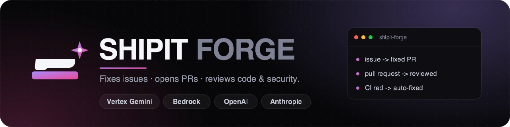
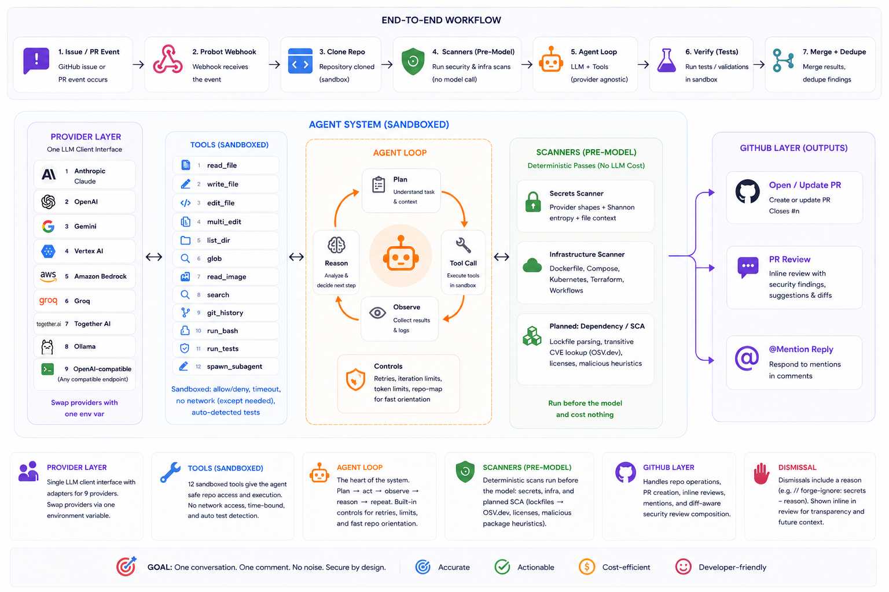

<div align="center">



<br/>

**An autonomous GitHub coding agent — like a teammate that fixes issues, opens PRs, and reviews pull requests (with a GitHub Advanced Security–style security pass).**

Multi-provider · Vision-aware · Self-hosted · Original open-source code.

<br/>

[](https://shipiit.github.io/forge/)
[](https://github.com/shipiit/forge/actions/workflows/ci.yml)
[](./LICENSE)
[](https://nodejs.org)
[](https://www.typescriptlang.org)
[](#-testing)
[](#-contributing)

<br/>

**Providers:**
&nbsp;`Anthropic`&nbsp;·&nbsp;`OpenAI`&nbsp;·&nbsp;`Gemini`&nbsp;·&nbsp;`Vertex AI`&nbsp;·&nbsp;`AWS Bedrock`&nbsp;·&nbsp;`Groq`&nbsp;·&nbsp;`Together`&nbsp;·&nbsp;`Ollama`&nbsp;·&nbsp;`OpenAI-compatible`

<br/>

### 🌐 [**shipiit.github.io/forge**](https://shipiit.github.io/forge/) &nbsp;·&nbsp; [Live examples](https://shipiit.github.io/forge/examples) &nbsp;·&nbsp; [Docs](https://shipiit.github.io/forge/docs)

<sub>**On this page:** [Quick start](#-quick-start-no-credentials) · [Deploy as an App](#-deploy-as-a-github-app) · [Use as an Action](#-use-it-as-a-github-action-no-server-your-own-keys) · [How it works](#-how-it-works) · [Config](#-configuration) · [Roadmap](#-roadmap)</sub>

</div>

---



---

## ✨ What it does

| | Capability | How you trigger it |
|---|---|---|
| 🛠️ | **Fix an issue → open a PR** — investigates the repo, writes the fix on a branch, runs the tests, opens a PR that closes the issue | Label `agent-fix`, or comment `/fix` |
| 🔍 | **Review a PR** — inline comments + summary verdict, quality **and** security lenses, **scoped strictly to the changed files** | Open a PR, or comment `/review` / `/review always` |
| 🛡️ | **Security review** — flags SSRF, injection, secrets, authz… with **severity**, a **CWE**, and a **suggested-fix** block | Auto on PRs, or comment `/security` |
| 🔎 | **Deterministic scanners** — secrets (provider shapes + entropy + context) and infrastructure (Dockerfile, compose, Kubernetes, Terraform, workflows), run before the model at no token cost and merged with its findings | Automatic on every review and audit |
| 🔬 | **Whole-repo audit** — maps entry points, follows untrusted input to dangerous sinks, one grouped report | Comment `/audit` |
| 📜 | **Change-history document** — one entry per merged change, written **from that diff alone**; arrives as a PR | `history: true` in `agent.yml` |
| ⏰ | **Routines** — a saved skill plus its triggers: cron, on-demand, or any repository event, each with filters | `routines:` in `agent.yml`, `/run <name>` |
| 🧩 | **Skills** — 8 built-in prompt packs with enforced tool allowlists; override from your repo or the workflow | `/code-review`, `/triage`, … |
| 🔁 | **Auto-fix failing CI** — reads the logs, corrects the code, re-runs the suite, pushes a `ci-fix` commit | Automatic on `forge/*` branches |
| 📝 | **Release notes** — generated from the commits in the release | On `release.published` |
| 👋 | **Invite as a reviewer** — request `@shipit-forge` on any PR and it reviews on demand | Add it as a PR reviewer |
| 💬 | **Answer @mentions** — explains code on issues; on a PR it can **push a follow-up commit** to the branch | Comment `@shipit-forge <ask>` |
| 🧭 | **Answer "how do I…?"** — reads the code and replies with numbered steps, real paths and commands, how to check it worked, and what to watch out for | Comment `/help <question>` |
| 🖼️ | **Reads screenshots** — pulls images out of issue/PR bodies and feeds them to vision models | Automatic |

**It never merges and never approves.** Every change is a pull request you control, and the review check run
always completes as `neutral` so it can't block a merge through branch protection.

### 🧠 The agent

- **9 providers** — Anthropic, OpenAI, Gemini, Vertex AI, AWS Bedrock, Groq, Together, Ollama, or any
  OpenAI-compatible endpoint. Set `FORGE_FALLBACK_PROVIDERS` for a fallback chain when one has an outage.
- **Prompt caching** — the system prompt, every tool schema, and the growing transcript are cached
  (Anthropic `cache_control`, Bedrock `cachePoint`), so repeated context bills at roughly a tenth of the
  input rate. OpenAI and Gemini automatic caching is reported too.
- **Extended thinking** — `FORGE_THINKING_BUDGET` on Anthropic and Gemini; `reasoning_effort` is set
  automatically for OpenAI's o-series and gpt-5 (including `max_completion_tokens`).
- **Token discipline** — a tool allowlist strips unused schemas from every turn, context compaction elides
  stale tool output once a transcript grows large, and `read_file` windows big files instead of dumping them.
- **Cost reporting** — every comment and PR carries a footer with tokens used, how many were served from
  cache, and the estimated spend.
- **Per-model output caps** — a shared 16k budget is clamped to what each model actually accepts.
- **Usage recording** — opt-in, and off unless you ask for it. Every run, turn, tool call, finding and
  transcript is written to a local SQLite file, which the [dashboard](#-usage-dashboard) reads.

### 🔒 Security

- **Deterministic per-edit checks** — every write is scanned for risky patterns (dynamic execution, unsafe
  deserialization, DOM injection, hardcoded credentials, weak crypto, workflow edits) with **no model call
  and no token cost**. Add your own rules in `.forge/security-patterns.json`.
- **Secret scanning that does not cry wolf** — twelve provider shapes (GitHub, AWS, Anthropic, OpenAI,
  Google, Slack, Stripe, npm, JWT, PEM, database URLs), Shannon entropy for generic assignments, and file
  context. `your-api-key-here` is not a finding; a real key in a README is, at lower severity — because
  people do paste real keys into documentation, and staying quiet there is quiet exactly where the
  mistake is easiest to make.
- **Infrastructure scanning** — the files that get the least review and decide the most: containers
  running as root, `:latest` bases, privileged pods, host mounts, buckets open to the world, `0.0.0.0/0`,
  actions pinned to a mutable tag, `pull_request_target`, and untrusted event text reaching a shell.
- **Dismissal you can audit** — resolve the conversation to dismiss a finding on that PR, or write
  `// forge-ignore: secrets — reason` on the line to dismiss it everywhere. It covers that line only,
  never the file, so a marker written last year cannot hide what was added under it since.
- **Sandboxed tools** — path-jailed file access, a command denylist, process-group timeouts, and output caps.
- **Secret redaction** on every log path.
- **Live Dependabot alerts** and **SARIF** (CodeQL, Semgrep) merged into the same triaged report.

### 🏢 For teams

- **Whole-organization rollout** — the App installs once across every repo; the Action needs no server at all.
- **GitHub Enterprise Server** — set `GHES_HOSTNAME` and everything else is identical.
- **Repo instruction files** — `FORGE.md` / `AGENTS.md` as project context, `REVIEW.md` as highest-priority
  review instructions that override the defaults.
- **Trigger filters** — author, title, body, base/head branch, labels, draft, merged, with
  `equals · contains · starts_with · is_one_of · is_not_one_of · matches_regex`.

---

## 🧭 Three ways to install & run it

Pick the one that fits — they all share the same engine.

| | Best for | Install | Run |
|---|---|---|---|
| **① CLI / local** | Trying it on your machine, scripting, CI of your own | `git clone https://github.com/shipiit/forge.git && cd forge && npm install && npm run build` | `node dist/cli.js fix --repo /path/to/repo --task "…" --provider fake` |
| **② GitHub Action** | Per-repo or per-org, **your own keys**, zero infra | Copy [`examples/forge.yml`](./examples/forge.yml) → `.github/workflows/forge.yml`, add a provider secret | Label an issue `agent-fix`, comment `/review`, or `@shipit-forge …` — it runs in **your** Actions |
| **③ Hosted GitHub App** | Org-wide, one-click install for many repos | Deploy the webhook server (Render / Cloud Run / Docker), then register via `app.yml` | Install on the org → events trigger it automatically on a server **you** host |

> **Not sure?** Start with **① CLI + `--provider fake`** (no keys, 2 min). Want it on GitHub without hosting → **② Action**. Want org-wide one-click → **③ App**. Full per-distribution credential setup for all four providers: **[`deploy/PROVIDERS.md`](./deploy/PROVIDERS.md)**.

Jump to: [① CLI](#-installation) · [② Action](#-use-it-as-a-github-action-no-server-your-own-keys) · [③ App](#-deploy-as-a-github-app)

---

## 📦 Installation

**Prerequisites:** [Node.js](https://nodejs.org) **≥ 20** (22 recommended), `git`, and (optional but
faster search) [`ripgrep`](https://github.com/BurntSushi/ripgrep).

```bash
# 1. Clone
git clone https://github.com/shipiit/forge.git
cd forge

# 2. Install dependencies
npm install

# 3. Build (compiles TypeScript → dist/)
npm run build

# 4. Verify everything works (546 unit + integration tests)
npm test
```

That's it — you now have the `forge` CLI at `node dist/cli.js`. (Optionally `npm link` to get a
global `forge` command.)

## 🚀 Quick start (no credentials)

The agent engine runs locally with a built-in **fake provider** — no API keys needed, great for a
first look:

```bash
node dist/cli.js fix --repo /path/to/any/repo --task "fix the failing login test" --provider fake
```

It clones nothing (works on the path you give), runs the tool loop, and prints what changed.

### Configure a provider securely — `forge setup`

The easiest, safest way to add your credentials. It writes a **gitignored `.env` with `chmod 600`**
so secrets never get committed:

```bash
node dist/cli.js setup
```

```
🔧 ShipIT Forge — provider setup

Which provider?
  1) Vertex AI Gemini
  2) Anthropic
  3) OpenAI
  4) AWS Bedrock
> 1
GCP project id: <your-gcp-project-id>
Location [us-central1]:
Model [gemini-2.5-pro]:
Provide the service-account key. Either:
  • a path to the JSON file, or
  • paste the JSON, then a line with just END
path or paste> <paste your service-account JSON, or a file path>
✅ Wrote .env (chmod 600) and updated .gitignore. Your secrets are gitignored.
```

**Setting up Vertex AI credentials (step by step):**

1. In Google Cloud Console → **IAM & Admin → Service Accounts**, create a service account (or reuse one).
2. Give it the **Vertex AI User** role (`roles/aiplatform.user`).
3. **Keys → Add key → JSON** to download the key file. Keep it private — never commit it.
4. Run `forge setup`, choose **Vertex AI Gemini**, enter your project id, and either **paste the JSON**
   or give the **path** to the downloaded file.

When you paste, the JSON is validated and saved to `.forge/vertex-sa.json` (`chmod 600`, gitignored);
when you give a path, it's referenced in place. Either way nothing secret is ever committed.

### Or set env vars manually

```bash
export LLM_PROVIDER=vertex
export VERTEX_PROJECT=my-gcp-project
export VERTEX_LOCATION=us-central1
export GOOGLE_APPLICATION_CREDENTIALS=/path/to/service-account.json
node dist/cli.js fix --repo /path/to/repo --task "…" --provider vertex
```

See [`.env.example`](./.env.example) for every provider's variables, and
**[`deploy/PROVIDERS.md`](./deploy/PROVIDERS.md)** for step-by-step credential setup for **all four
providers** (Vertex Gemini, Bedrock, OpenAI, Anthropic) across CLI / Action / App.

### Test it end-to-end with a real model (2 minutes)

Make a tiny buggy repo and let Forge fix it:

```bash
# 1. A throwaway repo with a deliberate bug + a test
mkdir /tmp/forge-try && cd /tmp/forge-try && git init -q
printf 'export const add = (a, b) => a - b; // bug\n' > sum.js
printf "import test from 'node:test'; import assert from 'node:assert'; import {add} from './sum.js';\ntest('adds', () => assert.strictEqual(add(2,3), 5));\n" > sum.test.js
printf '{"type":"module","scripts":{"test":"node --test"}}\n' > package.json
git add -A && git commit -qm init

# 2. Point Forge at it with your provider (Vertex shown)
cd -                                   # back to the forge repo
export GOOGLE_APPLICATION_CREDENTIALS=/path/to/service-account.json
node dist/cli.js fix --repo /tmp/forge-try \
  --task "add() subtracts instead of adding; fix it so the tests pass" \
  --provider vertex --model gemini-2.5-pro
```

Forge will read `sum.js`, change `a - b` → `a + b`, run `node --test`, confirm it passes, and print
the diff. *(This exact flow is verified working against Vertex AI Gemini 2.5 Pro.)* ✅

---

## 🤖 Deploy as a GitHub App

> **Publishing the code ≠ running the agent.** GitHub stores your repo and the App *registration*,
> but the agent runs on **your** server. GitHub sends webhooks → your server clones the repo, calls
> the model, and opens the PR/review. Docker is just a portable way to run that server anywhere.

**1. Deploy the webhook server** (runs 24/7 — no laptop). Pick a host:

- **No GCP, easiest:** [Render](./deploy/RENDER.md) — connect the repo, set env vars, done (uses [`render.yaml`](./render.yaml)).
- **Google Cloud Run** (one command): see [`deploy/DEPLOY.md`](./deploy/DEPLOY.md)
  ```bash
  PROJECT=your-gcp-project-id APP_ID=… WEBHOOK_SECRET=… \
    PRIVATE_KEY_FILE=./shipit-forge.private-key.pem ./deploy/cloudrun.sh
  ```
- **Any host with Docker** (Railway, Fly.io, a VPS):
  ```bash
  docker build -t shipit-forge . && docker run -p 3000:3000 --env-file .env shipit-forge
  ```

It's a standard Node/Docker app — it just needs a **public HTTPS URL**. Set the provider/App env vars
(see [`deploy/PROVIDERS.md`](./deploy/PROVIDERS.md)); on non-GCP hosts pass the Vertex key as
`VERTEX_CREDENTIALS_JSON` (the server writes it to a file at boot). Never set `WEBHOOK_PROXY_URL` in production.

**2. Register the GitHub App (one click)**

With the server running, open its URL (e.g. `http://localhost:3000` in dev, or your public URL).
Probot serves a **registration page** driven by [`app.yml`](./app.yml):

1. Click **Register a GitHub App** → it redirects you to GitHub with the name, permissions, and
   events pre-filled from `app.yml`.
2. Pick the **owner** — choose your **organization** (e.g. `shipiit`) so the App belongs to the org.
3. Confirm. GitHub creates the App and redirects back; Probot **automatically writes** `APP_ID`,
   `PRIVATE_KEY`, and `WEBHOOK_SECRET` into your `.env`. Add your provider vars and restart.

Prefer manual? GitHub → **Settings → Developer settings → GitHub Apps → New GitHub App**, then copy
the permissions/events from [`app.yml`](./app.yml).

> **Keep it private while testing.** `app.yml` has `public: false`, so only orgs **you administer**
> can install it — perfect for trying it inside your own org first. Flip to `public: true` later to
> allow any org and to list it on the Marketplace.

**Set the App icon** — in the App's **Settings → Display information → Logo**, upload
[`assets/logo.png`](./assets/logo.png) (the anvil-and-spark mark). A 512×512 and a 1024×1024
([`logo-1024.png`](./assets/logo-1024.png)) export are included.

**3. Install on your org (test it)** — App page → **Install App** → your org → pick **one test repo**
(or All repositories). Then open an issue with the `agent-fix` label, or request `@shipit-forge` on a
PR, and watch it work. Once it behaves, widen to all repos and/or make it public.

**4. Invite & test it** — in any repo of that org:
- ask **`/help how do I …?`** in any issue or PR → it reads the code and answers in steps;
- open an issue and add the label **`agent-fix`** (or comment **`/fix`**) → Forge opens a fix PR;
- open a PR → Forge auto-reviews it; or **request `@shipit-forge` as a reviewer** on an existing PR;
- comment **`/review`**, **`/security`**, or **`@shipit-forge <ask>`** anywhere.

> **Watch it work:** the server logs every event and tool call (with secrets redacted). For Docker,
> `docker logs -f <container>`. A failed run still comments on the issue/PR explaining what happened.

### Run locally without deploying (for development)

You can receive real GitHub webhooks on your laptop using a proxy — no hosting needed:

```bash
cp .env.example .env        # fill in APP_ID, PRIVATE_KEY, WEBHOOK_SECRET + your provider vars
npm run dev                 # starts the webhook server with hot reload
# Probot prints a smee.io proxy URL on first run; set it as the App's webhook URL.
```

This is the fastest way to **try the App end-to-end and invite it on a test PR** before committing to
a hosting provider.

---

## ⚡ Use it as a GitHub Action (no server, your own keys)

Prefer "just add a file" with **no hosting and no app registration**? Use the Action — each repo/org
runs Forge in its **own** CI with its **own** provider key. This is the per-org-credentials model
(like Claude Code's Action).

1. Add your provider key as a repo/org **secret** (Settings → Secrets and variables → Actions),
   e.g. `VERTEX_SA_JSON`, `OPENAI_API_KEY`, or `ANTHROPIC_API_KEY`.
2. Copy [`examples/forge.yml`](./examples/forge.yml) to `.github/workflows/forge.yml` (full guide,
   incl. acting as your own App bot like Claude: [`deploy/GITHUB_ACTIONS.md`](./deploy/GITHUB_ACTIONS.md)):

```yaml
name: ShipIT Forge
on:
  issues: { types: [opened, labeled] }
  issue_comment: { types: [created] }
  pull_request: { types: [opened, synchronize, review_requested] }
  pull_request_review_comment: { types: [created] }
permissions: { contents: write, pull-requests: write, issues: write, checks: read, statuses: read, actions: write }
jobs:
  forge:
    runs-on: ubuntu-latest
    steps:
      - uses: shipiit/forge@v2
        with: { provider: vertex }
        env:
          LLM_PROVIDER: vertex
          VERTEX_PROJECT: ${{ vars.VERTEX_PROJECT }}
          VERTEX_CREDENTIALS_JSON: ${{ secrets.VERTEX_SA_JSON }}
```

That's it — label an issue `agent-fix`, comment `/review` on a PR, or `@shipit-forge` anything, and
it runs in **your** Actions with **your** key and compute. No server to host, nothing to register.

> **Action vs hosted App:** the **Action** = per-org keys, zero infra, runs in their CI. The
> **App** (above) = one server you host and pay for, one-click install for others. Same engine.

## 📊 Usage dashboard

Where the money goes, which tool is slow, and why a particular run cost what it did.

**Recording is opt-in and off by default** — it stores repository names, actor logins and error strings,
which is not something to switch on for somebody without asking. Set `FORGE_USAGE_DB` (a path) or
`FORGE_USAGE=1` on whichever surface runs the agent — the App, the Action, or the CLI — and runs start
landing in it.

```bash
# 1. Record into a local database
export FORGE_USAGE_DB=.forge/usage.db

# 2. Serve the API (always authenticated; prints a token if you have not set one)
npx forge dashboard --db .forge/usage.db --port 4300

# 3. Open the dashboard and point it at that API under "Connection"
#    https://shipiit.github.io/forge/dashboard
```

What it answers:

| Page | Question it answers |
|---|---|
| **Overview** | What did this month cost, how much did caching save, what is the success rate? |
| **Runs** | Every run, sortable, with a turn-by-turn breakdown and the full transcript. |
| **Events** | Which trigger, surface and actor started the work — and what each one costs. |
| **Tool reliability** | p95 latency and error rate per tool, plus every failure with what it said. |
| **Findings** | Every finding the review and audit flows reported, by severity, lens and file. |

Opening a run shows each turn's latency, tokens and **cache reads** (so you can watch the cache grow), the
tool calls with their arguments, the findings, the commit or PR it produced, and the transcript rendered as
a conversation rather than a wall of JSON.

**Everything is token-gated.** There is no unauthenticated mode: the standalone server generates a token
when you have not configured one and prints it with the URL, and it binds to loopback unless you say
otherwise. To mount it on a hosted App's existing webhook server instead:

```bash
FORGE_USAGE_DB=/data/usage.db
FORGE_DASHBOARD_TOKEN=<a long random string>   # without it, nothing is mounted at all
FORGE_DASHBOARD_ORIGIN=https://your-site       # only if the dashboard is served elsewhere
```

It appears at `/usage` on the same host. Retention runs at startup: transcripts are kept 14 days, diffs and
tool calls 90, and the run/turn/finding history — the trend data, and the small part — forever.

**Storage**: metadata in SQLite, payloads gzipped to disk beside it. Roughly 20 KB per run, so a thousand
runs a month is about 20 MB a year.

---

## 🧩 Configuration

Per-repo via `.github/agent.yml` (all optional), with env-var defaults:

```yaml
model: gemini-2.5-pro          # provider-specific model id
trigger_label: agent-fix
auto_fix: label                # label | opened | off
auto_review: always            # always | requested | off
test_command: "npm test"       # else auto-detected
review_depth: standard         # light | standard | deep
ignore_paths: ["dist/**", "*.lock"]
```

| Env var | Default | Effect |
|---|---|---|
| `LLM_PROVIDER` | `anthropic` | `vertex` · `bedrock` · `openai` · `anthropic` |
| `FORGE_AUTO_FIX` | `label` | `opened` = attempt a PR on **every** new issue (full auto) |
| `FORGE_AUTO_REVIEW` | `always` | `requested` = only when invited / `/review` |
| `MAX_ITERATIONS` | `25` | Max agent tool-loop steps per run |

---

## 🛠️ How it works

```
issue / PR event ─▶ Probot webhook ─▶ clone repo (sandbox)
                                          │
                  scanners ◀─────────────┤   (no model call: secrets, IaC)
                       agent loop ◀───────┘   (LLM + tools, provider-agnostic)
                       read · search · edit · multi_edit · glob · git_history · run_bash · run_tests
                                          │
                       verify (tests) ────┤
                                          │
                       merge + dedupe ────┘   (one comment per problem)
                                          │
                 ┌────────────────────────┼────────────────────────┐
                 ▼                         ▼                        ▼
          open PR (Closes #n)      PR review (inline +        @mention reply
                                   security + suggestions)
```

- **Provider layer** (`src/providers`) — one `LLMClient` interface; adapters normalize chat +
  tool-calling + images for Anthropic, Vertex Gemini, OpenAI, Bedrock. Swap providers with one env var.
- **Tools** (`src/agent/tools`) — `read_file`, `write_file`, `edit_file`, `multi_edit`, `list_dir`,
  `glob`, `read_image`, `search`, `git_history`, `run_bash` (sandboxed: allow/deny, timeout, no
  network), `run_tests` (auto-detected).
- **Agent loop** (`src/agent/loop.ts`) — chat → tool calls → results → repeat, with retries,
  iteration + token limits, and a repo-map for fast orientation.
- **Scanners** (`src/scan`) — deterministic passes that run *before* the model and cost nothing: a
  secrets scanner (provider shapes + Shannon entropy + file context) and an infrastructure scanner
  (Dockerfile, compose, Kubernetes, Terraform, workflows). A model reads past the fourth key in a
  config file; these do not, and they give the same answer twice. Their findings are merged and
  deduplicated with the model's, so one weakness that both notice arrives as **one** comment.
- **GitHub layer** (`src/github`) — vision image extraction, workspace clone/branch/commit/push,
  PR composer, diff-aware security review composer; wired to webhooks in `src/app.ts`.
- **Dismissal** — resolving a review conversation dismisses that finding for the pull request;
  `// forge-ignore: secrets — reason` on the line dismisses it everywhere. The marker is deliberately
  in the code rather than in a database: it arrives through review, and the next reader can see both
  the dismissal and the reason for it.

---

## 🧪 Testing

```bash
npm test         # vitest — 546 unit + integration tests
npm run typecheck
```

Everything is testable **without credentials**: a scripted fake provider drives the agent loop, and
each real adapter is verified via pure normalization functions + injected mock clients. CI runs
typecheck + tests + build on every push.

Coverage is weighted toward the logic that decides what the agent *does* — routing, filters, review
scoping, config parsing, and the workflow generator — because those are the parts that fail quietly
rather than loudly. A malformed `agent.yml`, an invalid regex in a filter, or a finding on a file the
PR never touched all have a test pinning the behaviour.

---

## 🗺️ Roadmap

- [x] Agent engine, 11 tools, sandbox, retries
- [x] 4 provider adapters + vision
- [x] GitHub App: issue→PR, PR review, security lens, @mentions
- [x] Review line-safety, `.github/agent.yml`, secret redaction, CI
- [x] Live provider smoke run (verified on Vertex Gemini 2.5 Pro)
- [x] Follow-up commits when @mentioned on a PR
- [x] Secure `forge setup` wizard (paste/point-to credentials, gitignored)
- [x] Recorded handler integration tests (mocked Octokit)
- [x] Cost tracking (per-run token + USD estimate)
- [x] CodeQL/SARIF ingestion (merge scanner findings into review)
- [x] Multi-pass self-review (agent critiques its own diff → draft PR on blockers)
- [x] npm-publishable package (`files`, bin, `prepublishOnly`)
- [x] GitHub Action distribution (per-org credentials, no server)
- [x] Sub-agents — orchestrator can delegate focused subtasks (depth-bounded)
- [x] Marketplace listing kit + privacy policy ([`deploy/MARKETPLACE.md`](./deploy/MARKETPLACE.md))
- [x] Spend caps + per-repository rate limiting
- [x] Findings → trackable issues, with fingerprints so a re-run does not refile them
- [x] Review thread resolution (no duplicate comments on a re-review)
- [x] Usage recording + dashboard (runs, turns, tools, findings, transcripts)
- [ ] Submit the Marketplace listing (needs the public, verified, hosted App — your step)

---

## 🔒 A note on provenance

ShipIT Forge is **original open-source code**. It does not copy or reuse any proprietary source. It
follows the same public, event-driven pattern as other GitHub coding bots, implemented from scratch.

## 🤝 Contributing

Issues and PRs welcome! Read **[CONTRIBUTING.md](./CONTRIBUTING.md)** for the dev setup, project layout,
how to add a provider, and the PR checklist. Use the **issue templates** (🐛 bug / 💡 feature) when
opening an issue. Run `npm test` before pushing — and feel free to let Forge review your PR. 😄

> `main` is protected: every change lands via PR, ShipIT Forge auto-reviews it (security + code), and a
> maintainer gives the final approval.

## License

[MIT](./LICENSE) © Rahul Raj

---

<div align="center">


### ShipIT Forge

**Autonomous GitHub coding agent** — fixes issues, opens PRs, reviews code with a security lens.

[🌐 Website](https://shipiit.github.io/forge/) &nbsp;·&nbsp; [📂 Examples](https://shipiit.github.io/forge/examples) &nbsp;·&nbsp; [📖 Docs](https://shipiit.github.io/forge/docs) &nbsp;·&nbsp; [⭐ GitHub](https://github.com/shipiit/forge)

<sub>Built by <a href="https://github.com/iamrraj">Rahul Raj</a> · MIT licensed · Made with 🔨</sub>

</div>
